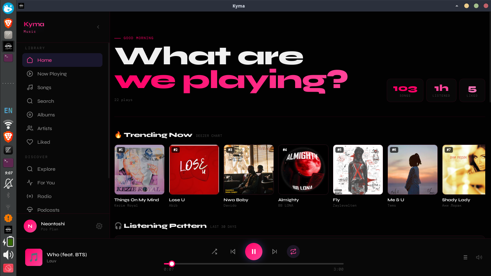
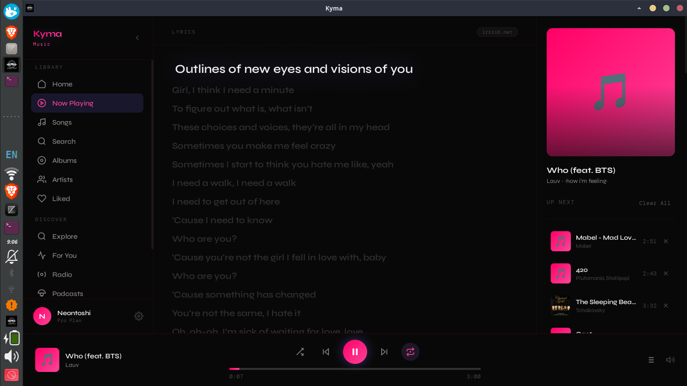
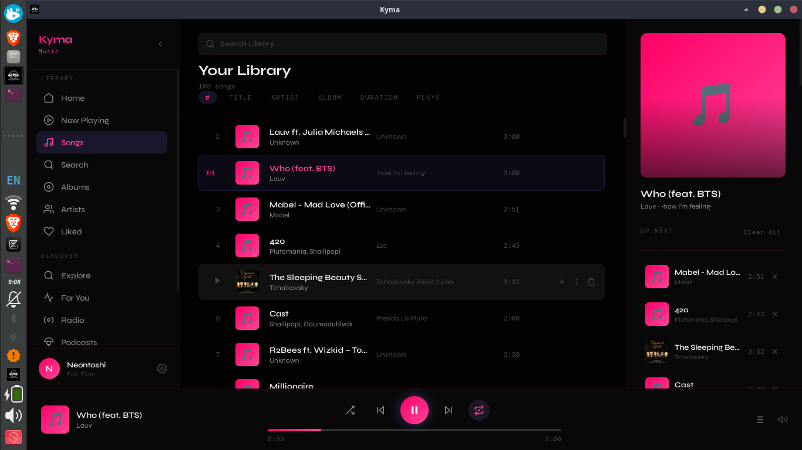
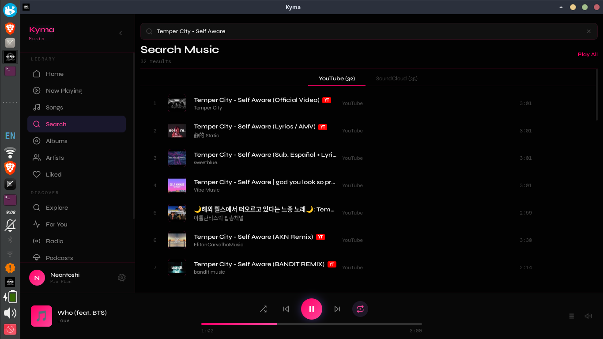
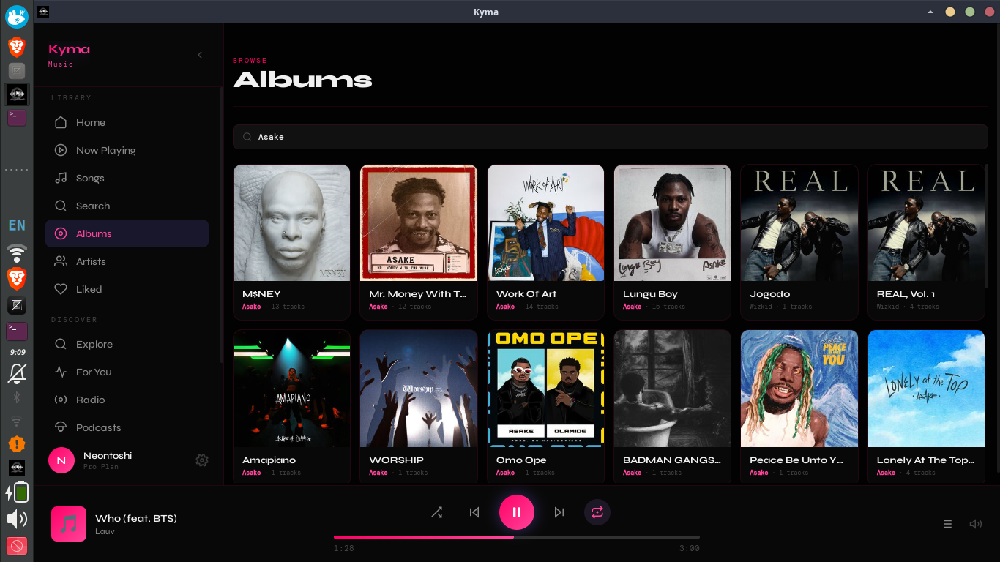
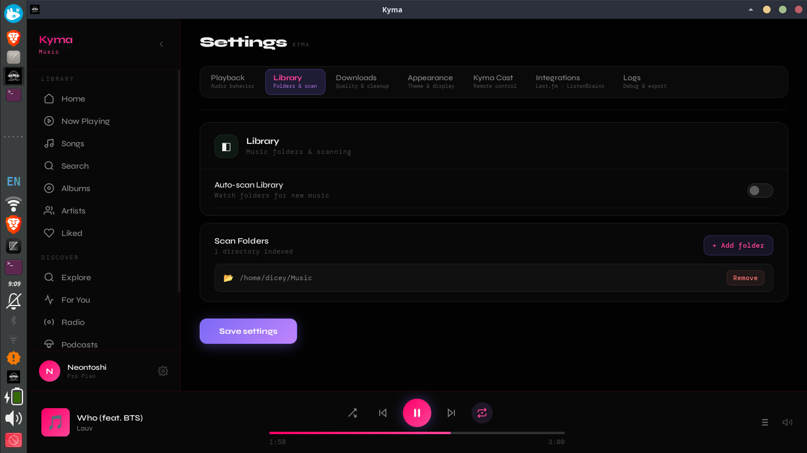

<div align="center">

<br />


<br />
<br />

# Kyma

**Experience music waves at premium — for free.**

*Local library · YouTube & SoundCloud · Radio · Podcasts*  
*No subscriptions. No telemetry. Your data stays local.*

<br />

[](LICENSE)
[](https://www.rust-lang.org)
[](https://tauri.app)
[](https://reactjs.org)
[](#-download)

<br />

[**Download**](#-download) &nbsp;·&nbsp; [**Features**](#-features) &nbsp;·&nbsp; [**Screenshots**](#-screenshots) &nbsp;·&nbsp; [**Build from Source**](#-building-from-source)

<br />

---

</div>

<br />

## ✨ Features

Kyma brings together everything you want from a music player — local files, online streaming, live radio, and podcasts — in one clean, privacy-first desktop app.

<br />

| &nbsp; | Feature | Description |
|--------|---------|-------------|
| 🎵 | **Local Library** | Scan folders and play your personal music collection with full metadata support |
| 🌊 | **Streaming** | Integrated YouTube & SoundCloud search and playback, no browser needed |
| 📻 | **Internet Radio** | Browse and stream thousands of live radio stations worldwide |
| 🎙️ | **Podcasts** | Subscribe to shows, auto-download episodes, track your listening progress |
| ❤️ | **Liked Songs** | Save favourites across all sources in one unified collection |
| 📋 | **Playlists** | Create, edit, and reorder custom playlists with drag-and-drop |
| 🔍 | **Universal Search** | Search your local library and online sources simultaneously |
| 🖥️ | **Cross-platform** | Native builds for Windows, Linux, and macOS |
| 🔒 | **Privacy First** | Zero telemetry, zero tracking — all your data lives on your machine |

<br />

---

<br />

## 📸 Screenshots

<br />

### Home

> Your personalised landing page — recent plays, recommendations, and quick access to everything.

<div align="center">
  
</div>

<br />
<br />

---

### Now Playing

> Full playback view with waveform visualizer, queue, and track details.

<div align="center">
  
</div>

<br />
<br />

---

### Library

> Your local collection, beautifully organised by artist, album, and genre.

<div align="center">
  
</div>

<br />
<br />

---

### Search

> Search across local files, YouTube, and SoundCloud — all from one place.

<div align="center">
  
</div>

<br />
<br />

---

### Albums

> Browse your collection by album with cover art and full tracklists.

<div align="center">
  
</div>

<br />
<br />

---

### Settings

> Tune Kyma to your preferences — audio output, streaming quality, library paths, and more.

<div align="center">
  
</div>

<br />

---

<br />

## 🚀 Download

Pick your platform and get started in seconds.

<br />

| Platform | Installer | Notes |
|----------|-----------|-------|
| 🐧 **Linux** | [Download `.deb`](https://github.com/Neontoshi/Kyma/releases) | Ubuntu / Debian-based |
| 🪟 **Windows** | [Download `.exe`](https://github.com/Neontoshi/Kyma/releases) | Windows 10 / 11 |
| 🍎 **macOS** | [Download `.dmg`](https://github.com/Neontoshi/Kyma/releases) | macOS 11+ |

<br />

> Prefer to build it yourself? See [Building from Source](#-building-from-source) below.

<br />

---

<br />

## 🛠️ Building from Source

### Prerequisites

Make sure you have the following installed before building:

- **Rust** — [rustup.rs](https://rustup.rs) (latest stable)
- **Node.js** — v18 or higher
- **yt-dlp** — required for YouTube & SoundCloud streaming

<br />

### 1 — Install Rust

```bash
curl --proto '=https' --tlsv1.2 -sSf https://sh.rustup.rs | sh
```

<br />

### 2 — Install yt-dlp

```bash
# Using pip
pip install yt-dlp

# On Ubuntu / Debian
sudo apt install yt-dlp

# On macOS (Homebrew)
brew install yt-dlp

# On Windows (winget)
winget install yt-dlp
```

<br />

### 3 — Clone & Install Dependencies

```bash
git clone https://github.com/Neontoshi/Kyma.git
cd Kyma
npm install
```

<br />

### 4 — Run in Development

```bash
npm run tauri dev
```

<br />

### 5 — Build for Production

```bash
npm run tauri build
```

Output binaries will be in `src-tauri/target/release/bundle/`.

<br />

---

<br />

## 🏗️ Tech Stack

| Layer | Technology |
|-------|------------|
| **Desktop Shell** | [Tauri 2.0](https://tauri.app) |
| **Backend** | Rust · Symphonia · CPAL |
| **Frontend** | React 18 · TypeScript · Zustand |
| **Streaming** | yt-dlp · YouTube Innertube API |
| **Database** | SQLite |
| **Build** | Vite |

<br />

---

<br />

## 📄 License

Kyma is open source under the [MIT License](LICENSE).

<br />

---

<div align="center">

<br />

Built with 🦀 Rust and ❤️ by [Neontoshi](https://github.com/Neontoshi)

<br />

*No subscriptions. No tracking. Just music.*

</div>
